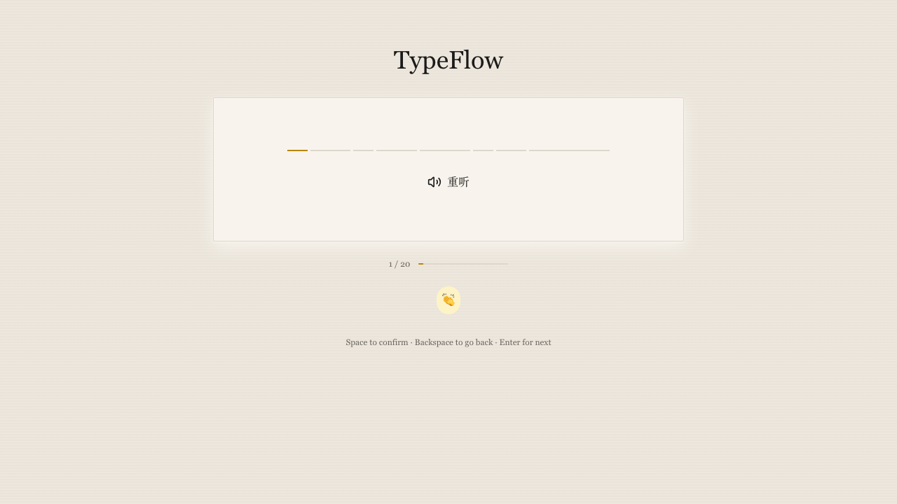

# TypeFlow

「纸上练习」—— 沉浸式英语听写练习应用。

Listen, type, learn. 一个安静的「学习角落」：一张纸、一支笔、一段朗读、一次书写。

## 技术栈

| 层 | 技术 |
|---|---|
| 前端 | Next.js 14 + React 18 + TypeScript + Tailwind CSS 3 |
| 后端 | Python FastAPI + Edge TTS (微软 Azure TTS) |
| 包管理 | npm (前端) / uv (后端) |

## 功能

- **填空式听写**：句子下划线占位，逐词输入，类似纸上填空练习
- **逐词反馈**：基于 Levenshtein 词对齐算法，区分正确/错误
- **键盘操作**：Space 确认单词 · Backspace 回退 · Enter 进入下一句
- **重听功能**：朗读过程中和反馈阶段均可重新播放句子
- **语音合成**：Edge TTS 生成自然发音，带缓存机制
- **掌声音效**：全对时播放欢庆掌声，可开关控制

## 截图



TypeFlow 界面简洁，模拟纸上听写体验。页面底部的 👏 按钮可开关掌声音效。

## 快速开始

### 前置条件

- Node.js >= 18
- Python >= 3.11
- [uv](https://github.com/astral-sh/uv) (Python 包管理)

### 启动后端

```bash
cd backend
python start.py
```

后端运行在 `http://localhost:8000`。

API 端点：
- `POST /api/tts` — 文字转语音
- `POST /api/check` — 答案检查与逐词对比
- `GET /api/tts/audio/{key}` — 获取缓存音频文件

## 交互说明

| 按键 | 作用 |
|---|---|
| Space | 确认当前单词，进入下一个 |
| Backspace | 当前为空时，回退到上一个单词 |
| Enter | 反馈阶段进入下一句 |

### 启动前端

```bash
cd frontend
npm install
npm run dev
```

前端运行在 `http://localhost:3000`。

## 项目结构

```
TypeFlow/
├── frontend/
│   ├── app/              # Next.js App Router 页面
│   ├── components/       # React 组件
│   │   ├── PaperSheet       # 纸张容器
│   │   ├── InteractiveSentence  # 填空式句子输入（逐词输入）
│   │   ├── PlayButton       # 播放按钮（含声波动画）
│   │   ├── ReplayButton     # 重听按钮
│   │   ├── FeedbackReport   # 逐词反馈
│   │   ├── StatsBar         # 统计条
│   │   ├── ProgressBar      # 进度指示
│   │   └── ...
│   ├── hooks/            # 自定义 Hooks (usePractice, useAudio)
│   └── lib/              # API 调用、类型定义、题库
├── backend/
│   ├── main.py           # FastAPI 应用 & API 路由
│   ├── start.py          # 启动脚本
│   └── pyproject.toml    # Python 依赖
└── DESIGN.md             # 完整设计文档（色彩/字体/布局/动效）
```

## 设计理念

设计核心：**如何让用户进入并保持专注练习的「心流」状态**。

以「旧纸张 + 墨水笔迹」为色彩叙事，模拟纸上听写体验。详见 [DESIGN.md](./DESIGN.md)。
